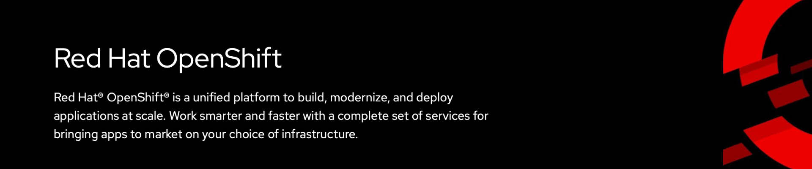

## 🔴  OpenShift Bootcamp Modules
          
   

---

### 🔹 [Module 1](https://github.com/ocp-workshop-wf/bootcamp/tree/main/module1): Introduction and Core Concepts 

- **1.0**  - What You’ll Learn 

- **1.1** - Introduction to OpenShift

- **1.2** - Difference between Kubernetes and OpenShift

### 🔹 [Module 2: Working with OpenShift Interfaces](https://github.com/ocp-workshop-wf/bootcamp/tree/main/module2)

- **2.0** – OpenShift Container Lifecycle  
- **2.1** – OpenShift CLI and Web Console  
- **2.2** – Creating and Managing Projects (Learning YAML)

---

### 🔹 [Module 3: Core OpenShift Resources](https://github.com/ocp-workshop-wf/bootcamp/tree/main/module3)

- **3.1** – OpenShift Resources Overview  
- **3.2** – Application Deployment in OpenShift  
- **3.3** – OpenShift Networking  
- **3.4** – OpenShift ConfigMaps

---

### 🔹 [Module 4: Application Deployment and Management](https://github.com/ocp-workshop-wf/bootcamp/tree/main/module4)

- **4.1** – Managing Secrets  
- **4.2** – Images and Image Streams  
- **4.3** – Builds and BuildConfigs  
- **4.4** – Deployment Strategies  
- **4.5** – Triggers

---

### 🔹 [Module 5: Advanced Deployment Options](https://github.com/ocp-workshop-wf/bootcamp/tree/main/module5)

- **5.1** – Source-to-Image (S2I)  
- **5.2** – OpenShift Storage and Volumes  
- **5.3** – Scaling and Debugging Applications  
- **5.4** – OpenShift Jobs

---

### 🔹 [Module 6: Mastering OpenShift](https://github.com/ocp-workshop-wf/bootcamp/tree/main/module6)

- **6.1** – Health Checks and Observability  
- **6.2** – Helm Charts
